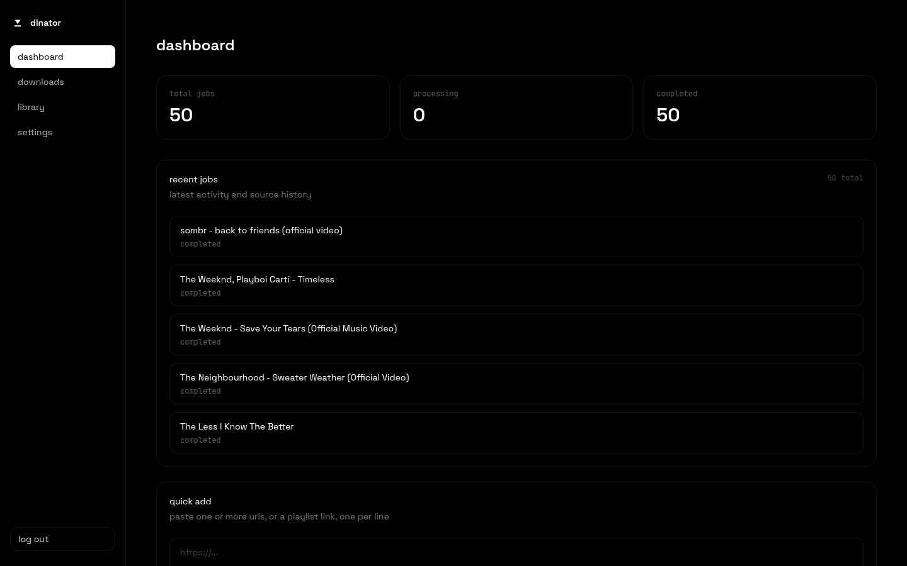
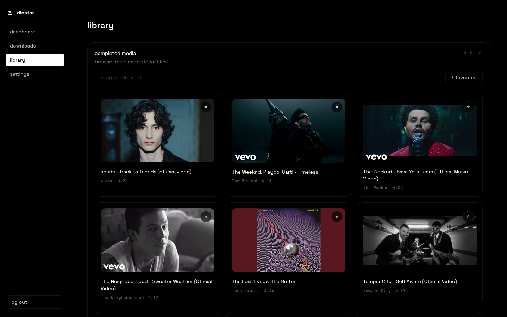
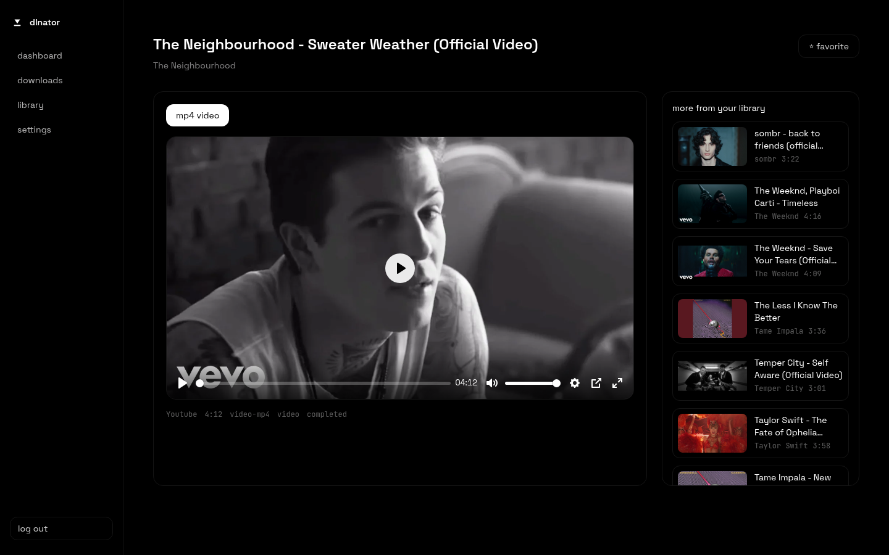
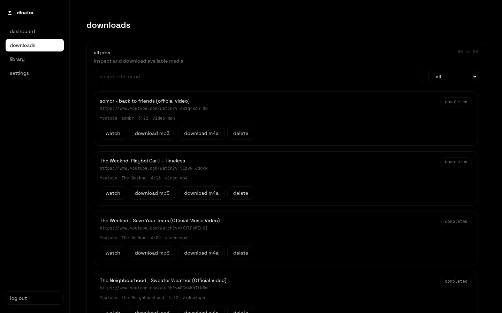
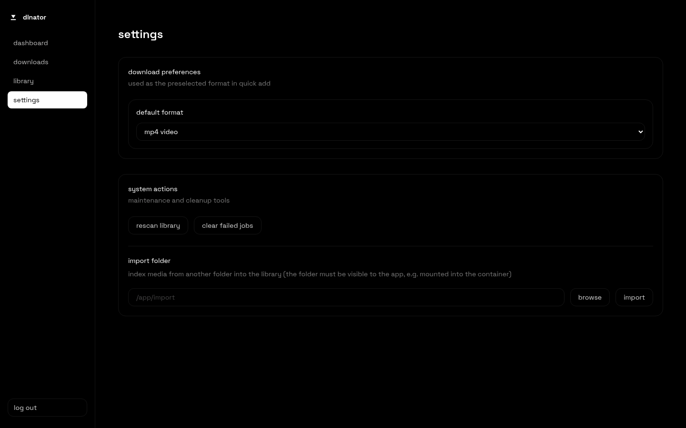

# dlnator

self-hosted yt-dlp downloader with a web ui: paste a url, download it as mp4/mp3/m4a, stream it back in-browser. postgres-backed, docker-first.

<table>
<tr>
<td align="center"><br><sub>dashboard</sub></td>
<td align="center"><br><sub>library</sub></td>
<td align="center"><br><sub>watch</sub></td>
</tr>
<tr>
<td align="center"><br><sub>downloads</sub></td>
<td align="center"><br><sub>settings</sub></td>
<td></td>
</tr>
</table>

## features

- any source yt-dlp supports, not just youtube
- mp4 / mp3 / m4a, playlists and bulk paste
- stream straight from the library, no re-download
- rescan or import an existing folder of media
- optional single-password auth for exposing it beyond localhost

## running it

```bash
docker compose up -d
```

app's on `http://localhost:3000`, reachable on your lan too. postgres and `./library` both persist across restarts/rebuilds.

for a shared password, drop an `.env` next to `docker-compose.yml`:

```bash
echo "AUTH_PASSWORD=your-password-here" > .env
docker compose up -d
```

unset it to leave the instance open.

### importing an existing library

settings → import folder indexes media from any folder without moving it. that folder has to be mounted into the container:

```yaml
  dlnator:
    volumes:
      - ./library:/app/library
      - /path/to/old/downloads:/app/import:ro
```

then point the import box at `/app/import`. it stays indexed in place, so keep the mount around.

## notes

- re-adding a url reuses the existing job instead of duplicating it
- deleting a job deletes its files too
- retry a failed download by clicking its format button again

## roadmap

- subtitle downloads

## contributing

PRs welcome — bug fixes, roadmap items, or anything else you think belongs here.
